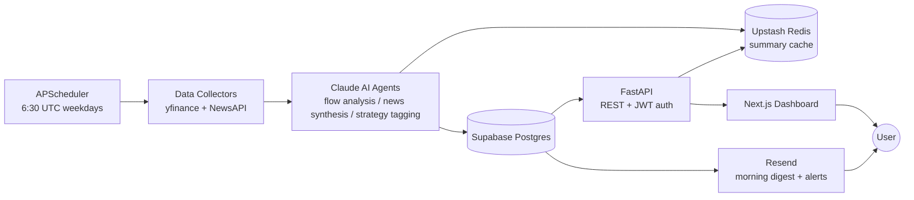

# VolterraAI

AI-powered options flow analysis and daily market briefing platform for retail traders.

[Dashboard screenshot]

## Architecture



## Tech stack

| Layer | Technology |
|---|---|
| Backend | Python 3.11, FastAPI, SQLAlchemy 2.0 (async), APScheduler |
| Frontend | Next.js 14 (App Router), TypeScript, Tailwind CSS *(planned)* |
| Database | Supabase Postgres (asyncpg driver) |
| AI | Anthropic Claude (claude-sonnet-4-20250514) via the official Python SDK |
| Caching | Upstash Redis (REST API) |
| Email | Resend |
| Auth | Supabase Auth (JWT verified server-side with PyJWT) |
| Infrastructure | Railway (backend), Vercel (frontend), Sentry, GitHub Actions |

## Features

- Daily scan of a 30-ticker watchlist for unusual options activity (volume/open-interest ratio) via yfinance
- AI-generated options flow summaries via Claude claude-sonnet-4-20250514: setup summary, flow interpretation, and risk note per ticker, with strict JSON output and a one-shot retry on parse failure
- News catalyst synthesis: recent headlines per ticker condensed into a catalyst note merged into each summary
- Strategy classification into a 7-tag taxonomy (momentum, earnings_play, iv_crush, breakout, hedge, contrarian, neutral)
- Trade journal with outcome tracking (win/loss/scratch/pending), soft delete, and per-user SQL-aggregated analytics (win rate by strategy and ticker, 30-trade equity trend)
- Morning brief email digest (top 5 setups) and per-user strategy alert emails via Resend
- Redis caching of AI output (24h flow summaries, 1h news notes, 1h analytics) to bound API spend
- Rate limiting (slowapi) with per-user JWT keying on write endpoints

## Local development setup

Prerequisites: Python 3.11+, Node 18+, Docker (optional, for local Postgres/Redis).

```bash
git clone https://github.com/victorolatunji27/volterra-ai.git
cd volterra-ai

# Backend
cd backend
python3.11 -m venv venv && source venv/bin/activate
pip install -r requirements.txt
cp .env.example .env          # fill in your keys (see table below)

# Database schema (against your Supabase or local Postgres)
psql $DATABASE_URL -f db/migrations/001_initial_schema.sql
# On Supabase, also apply RLS + the signup trigger (or paste into the SQL Editor):
psql $DATABASE_URL -f db/migrations/002_rls_policies.sql
psql $DATABASE_URL -f db/migrations/003_user_profile_trigger.sql

# Run the data pipeline manually
python scheduler/daily_scan.py

# Run the API
uvicorn main:app --reload     # http://localhost:8000/docs

# Tests
ENABLE_SCHEDULER=false python -m pytest tests/ -v
```

`docker-compose up` from the repo root starts local Postgres and Redis. docker-compose is for local dev only. Production uses Railway for the backend (with Supabase Postgres and Redis via Upstash).

## Environment variables

| Variable | Required | Description | Where to get it |
|---|---|---|---|
| `DB_USER` / `DB_PASSWORD` / `DB_HOST` / `DB_PORT` / `DB_NAME` | Yes | Postgres connection pieces (URL is assembled and password-encoded at runtime) | Supabase → Settings → Database |
| `ANTHROPIC_API_KEY` | Yes | Claude API key (needs credits) | console.anthropic.com |
| `NEWSAPI_KEY` | Yes | News headlines (free tier: 100 req/day) | newsapi.org |
| `UPSTASH_REDIS_REST_URL` / `UPSTASH_REDIS_REST_TOKEN` | No | Cache; the app degrades to no-cache without it | upstash.com → database → REST API |
| `SUPABASE_JWT_SECRET` | Yes (for auth routes) | Verifies user JWTs | Supabase → Settings → API → JWT Secret |
| `RESEND_API_KEY` | No (email features) | Digest + alert emails | resend.com |
| `SENTRY_DSN` | No | Error tracking; skipped if unset | sentry.io |
| `ALLOWED_ORIGINS` | Yes (prod) | Comma-separated CORS origins | your Vercel URL |
| `ENVIRONMENT` | No | `development` / `production` | — |
| `ENABLE_SCHEDULER` | No | Set `false` to run the API without APScheduler jobs | — |
| `TRADIER_API_KEY` | No (until Tradier swap) | Real-time options data upgrade path | developer.tradier.com |

## Rate limits

| Endpoint | Limit | Keyed by |
|---|---|---|
| `GET /api/scans/today` | 10/minute | IP |
| `POST /api/scans/trigger` | 3/hour | JWT user id (falls back to IP) |
| `GET /api/scans/{ticker}`, `GET /api/scans/{ticker}/summary` | 60/minute | IP |
| `GET /api/demo/setup` | 60/minute | IP (public) |
| `POST /api/journal` | 30/minute | JWT user id (falls back to IP) |
| `GET /api/analytics/*` (all five) | 20/minute | JWT user id (falls back to IP) |
| `PATCH /api/users/me/strategies` | 10/minute | JWT user id (falls back to IP) |
| `POST /api/users/me/test-alert` | 3/day | JWT user id |
| All other routes | 30/minute | default (IP) |

Authenticated routes key on the verified Supabase user id so users sharing a
NAT don't block each other; the JWT signature is checked before the `sub`
claim is trusted (an unverifiable token falls back to the client IP).

Exceeding a limit returns `429` with JSON
`{"detail": "Rate limit exceeded. Try again in {retry_after}s."}` and a
`Retry-After` header.

## Architecture decisions and tradeoffs

**Claude over GPT-4.** I chose Claude because the analysis task is constrained-format JSON generation where instruction-following matters more than breadth, and Claude's system-prompt adherence with few-shot examples produced more consistent field lengths in testing. The downside is a single-vendor dependency for the core feature. If I were scaling to 10,000 users, I would add a provider abstraction so summaries could fail over to a second model during outages.

**APScheduler over Celery or Railway Cron.** APScheduler runs in-process with zero extra infrastructure — no broker, no worker fleet — which is the right cost for one daily job chain. The honest limitation: jobs do not survive a process restart mid-run, and a redeploy at 6:29 UTC can skip a scan. At scale I would move to Railway Cron Jobs (which survive redeploys) or Celery once multiple queues and retries justify a broker.

**Supabase Auth over hand-rolled JWT auth.** Supabase issues and refreshes tokens, handles password reset and OAuth, and my backend only verifies signatures with a shared secret — that is an entire class of security code I do not have to own. The tradeoff is coupling user identity to Supabase. At 10,000 users I would still keep it; auth is the last thing to hand-roll.

**Redis caching over Postgres-only.** AI summaries are expensive (an API call) and immutable for a day, so a 24h Redis TTL bounds Claude spend to one call per ticker per day regardless of traffic. The limitation is a second stateful service and eventual-consistency between cache and DB. The Upstash REST API was chosen over the redis protocol because it works from serverless and behind strict egress rules.

**Polling (daily batch) over WebSocket streaming.** Retail users act on a morning brief, not millisecond flow, so a 6:30 UTC batch matches the product and costs almost nothing. The limitation is staleness during the trading day. If users demanded intraday alerts, I would add a 15-minute scan loop before reaching for streaming infrastructure.

**yfinance over Tradier.** yfinance requires no API key and gets the pipeline moving immediately. Tradier gives real-time flow and richer chain data. The upgrade path is: prove the pipeline works with yfinance, then swap in Tradier before onboarding real users — the fetcher already has a Tradier implementation behind the same interface.

## Known limitations

- IV rank is approximate (current-chain IV with a VIX proxy, not true 52-week historical IV rank)
- Options data is delayed (yfinance; the free Tradier tier is also 15-minute delayed)
- The digest sends only on market days (Mon–Fri cron)
- The Anthropic account must have credits or all AI summaries degrade to null (the pipeline still stores raw scans)

## License

MIT
